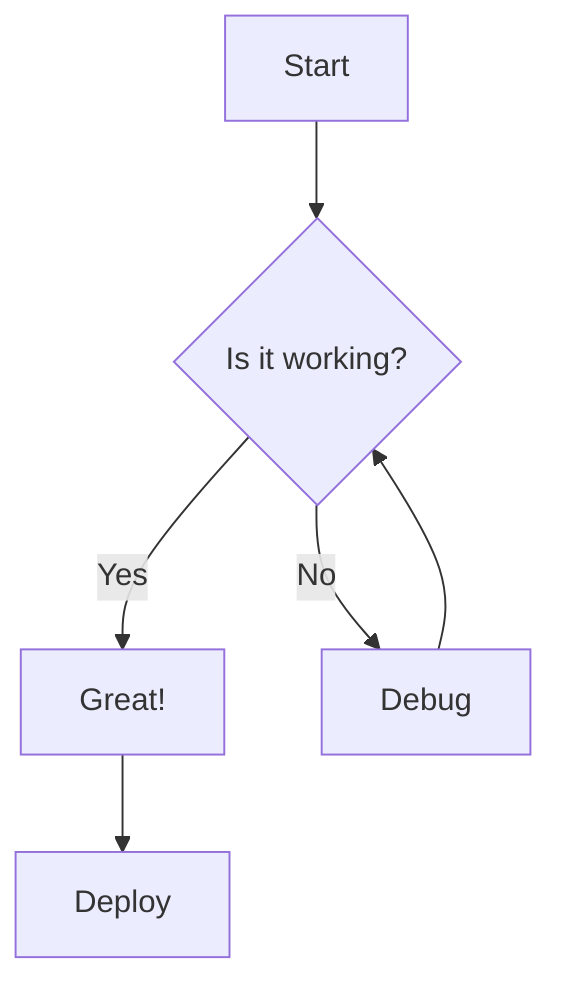

# Glowing Vim Markdown Preview

A lightweight Vim plugin that provides real-time markdown preview using [glow](https://github.com/charmbracelet/glow) - the glamorous command-line markdown renderer.

## Features

- **Toggle markdown preview** with a simple key mapping
- **Beautiful rendering** powered by glow's terminal-based styling
- **Split window layout** - preview opens in a vertical split
- **Live preview** - renders your current buffer content
- **No external dependencies** beyond glow
- **Terminal-based** - works entirely within your terminal environment

## Requirements

- Vim with terminal support (Vim 8.0+ or Neovim)
- [glow](https://github.com/charmbracelet/glow) command-line tool

## Installation

### 1. Install glow

#### macOS
```bash
brew install glow
```

#### Linux
```bash
# Ubuntu/Debian
sudo mkdir -p /etc/apt/keyrings
curl -fsSL https://repo.charm.sh/apt/gpg.key | sudo gpg --dearmor -o /etc/apt/keyrings/charm.gpg
echo "deb [signed-by=/etc/apt/keyrings/charm.gpg] https://repo.charm.sh/apt/ * *" | sudo tee /etc/apt/sources.list.d/charm.list
sudo apt update && sudo apt install glow

# Arch Linux
pacman -S glow

# Or use go
go install github.com/charmbracelet/glow@latest
```

#### Windows
```powershell
# Using winget
winget install charmbracelet.glow

# Using scoop
scoop install glow
```

### 2. Install the plugin

#### Using vim-plug
```vim
Plug 'yourusername/glowing-vim-markdown-preview'
```

#### Using Vundle
```vim
Plugin 'yourusername/glowing-vim-markdown-preview'
```

#### Manual installation
Copy `markdown-preview.vim` to your Vim plugin directory:
```bash
# For Vim
cp markdown-preview.vim ~/.vim/plugin/

# For Neovim
cp markdown-preview.vim ~/.config/nvim/plugin/
```

## Usage

### Default Key Mapping
- `\m` - Toggle markdown preview on/off

### Commands
- `:MarkdownPreviewToggle` - Toggle the markdown preview

### In Preview Window
- `q` - Close the preview and return to your markdown file

## How It Works

1. **Open a markdown file** in Vim
2. **Press `\m`** to open the preview in a vertical split
3. **The preview renders** your current buffer content using glow
4. **Press `q`** in the preview window to close it
5. **Toggle again** with `\m` to reopen with updated content

## Configuration

The plugin works out of the box, but you can customize the key mapping if desired:

```vim
" Use a different key mapping (example: <Leader>p)
nnoremap <Leader>p :MarkdownPreviewToggle<CR>
```

## Examples

The plugin beautifully renders various complex markdown elements through glow:

### Code Blocks with Syntax Highlighting
```python
def fibonacci(n):
    """Generate Fibonacci sequence up to n."""
    a, b = 0, 1
    while a < n:
        print(a, end=' ')
        a, b = b, a + b
    print()

fibonacci(100)
```

### Tables
| Feature | Status | Notes |
|---------|--------|-------|
| Syntax Highlighting | ✅ | Supports 200+ languages |
| Tables | ✅ | Auto-formatted |
| Math | ✅ | LaTeX-style rendering |
| Mermaid Diagrams | ✅ | Flowcharts, sequences, etc. |

### Math Equations
```latex
$$
E = mc^2
$$

Inline math: $\sum_{i=1}^{n} x_i = x_1 + x_2 + \cdots + x_n$
```

### Mermaid Diagrams


### Task Lists and Complex Lists
- [x] Basic markdown rendering
- [x] Syntax highlighting
- [x] Table support
- [ ] Plugin customization options
  - [x] Key mapping configuration
  - [ ] Theme selection
  - [ ] Window size options

### Blockquotes and Callouts
> **Note**: This plugin leverages glow's powerful rendering engine to display all these elements beautifully in your terminal.

> **Warning**: Make sure glow is installed for the best experience.

### Links and Images
- [Glow Repository](https://github.com/charmbracelet/glow)
- [Vim Documentation](https://vimdoc.sourceforge.net/)

All of these elements render with proper styling, colors, and formatting thanks to glow's terminal-based rendering engine.

## Fallback Behavior

If glow is not installed or terminal support is unavailable, the plugin falls back to displaying the raw markdown content in a split window.

## Acknowledgments

- **[glow](https://github.com/charmbracelet/glow)** by Charm - The beautiful terminal markdown renderer that powers this plugin
- **[Charm](https://charm.sh/)** - For creating amazing terminal-based tools

## License

MIT License - feel free to use, modify, and distribute as you see fit.

## Contributing

Contributions are welcome! Please feel free to submit issues, feature requests, or pull requests.